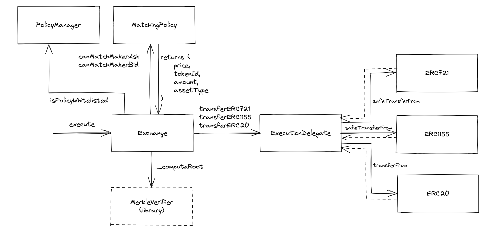

# Moonboat Marketplace Smart Contracts

These smart contracts originally came from the blur.io team, and we've made some modifications and integrations to accommodate Moonboat and the EOS EVM.
  

## Contracts addresses on EOS EVM

* [NFTExchange](https://explorer.evm.eosnetwork.com/address/0x2cA688aDde263B2Ad226B9a2540bF86abb84032A)
* [ExecutionDelegate](https://explorer.evm.eosnetwork.com/address/0xadE7b7F09067849D6D6126F749d6ee498f7068a9)
* [PolicyManager](https://explorer.evm.eosnetwork.com/address/0xa9E219c2dBe7BBa535aaB622A4d46aA5B78Bd8F5)
* [PolicyERC721](https://explorer.evm.eosnetwork.com/address/0x95b0030aA802258ca5e3025240a9514422640ef0)
* [PolicyERC1155](https://explorer.evm.eosnetwork.com/address/0xb188a52eB2F00b41dfECdecD5CF0644503b48e64)
